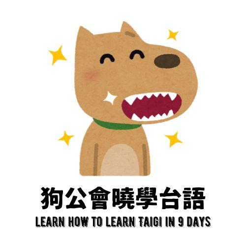

{}
Learn How to Learn Taigi in 9 Days!
<!-- {.mt-5} -->
{}

{}
「狗公」、「九工」攏是「káu kang」，相招你撥9工ê時日，跟台灣狗公－烏狗兄讀看māi、學看māi！
{.h3 .text-center}
{}

{}
《狗公會曉學台語》是1本台語文入門教材。
{.h2 .text-center}
進前號做《Hê-bí ê台語台文基礎教材》（A Textbook of Basic Taigi Phonics and Writing System By Hê-bí），咧教Taigi orthography，也就是台語正寫法（chèng-siá-hoat）。
{.h3 .text-center .mt-5}
＜ 目前當咧改版 ＞
{.h3 .text-center .mt-5}
{}

{}
《狗公會曉學台語》台語文入門教材 PDF 檔案免費提供大家 download，使用著代表你同意遵守授權條款：
{.h3 .text-center}
<a style="display:block; padding:10px" href="https://creativecommons.org/licenses/by-nc-nd/4.0/deed.zh-hant" target="_blank">
註明名姓-非商業性-禁止改作 4.0 國際 (CC BY-NC-ND 4.0)
</a>

請注意！資料分享ê時無允准取內底1部份單獨使用。
{.h3 .text-center .mt-5}

請盡量分享咱這ê網址著好，內容隨時會koh修改。
{.h3 .text-center .mt-3}
{}

{}

{.text-center}

<a class="btn btn-lg btn-primary me-3 mb-4" href="https://bit.ly/ohtaigi20240426" target="_blank">
  Táng-ló͘ / Download / 下載 <i class="fa-solid fa-file-arrow-down ms-2"></i>
</a>

版本：2024.04.19
{.h4 .text-center}
（有時間有需要就會更新）
{.h5 .text-center}
{}
